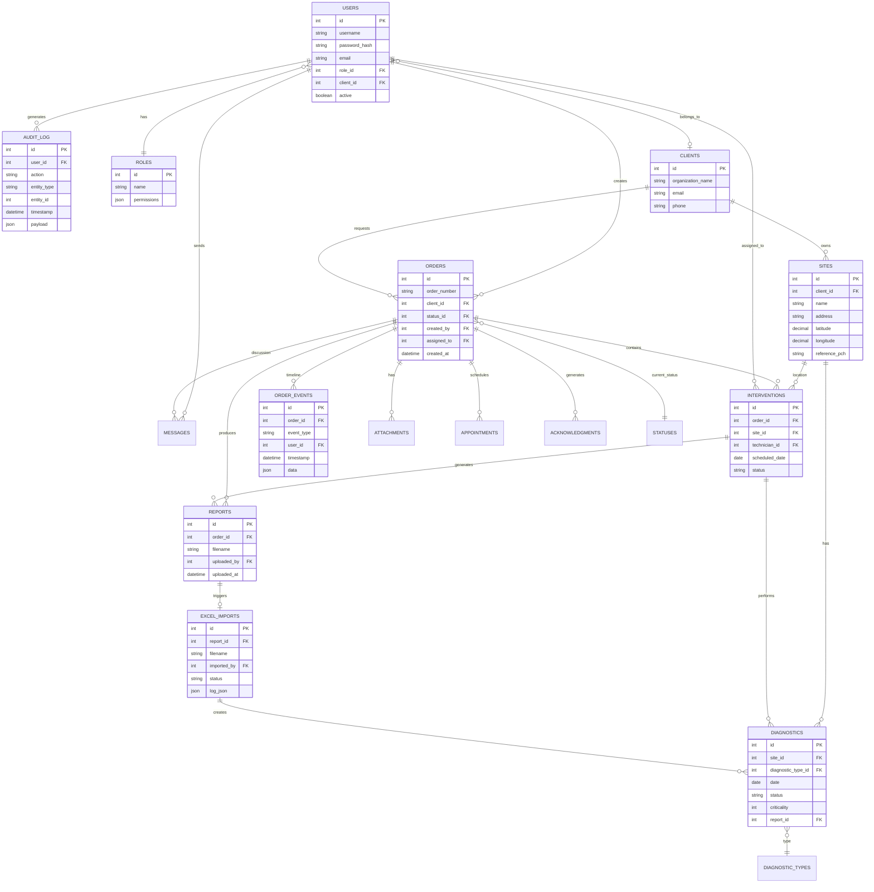
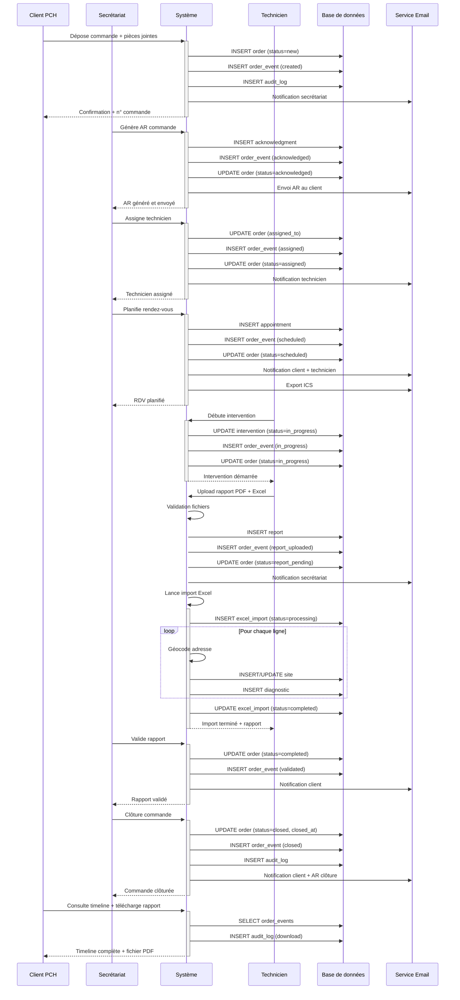
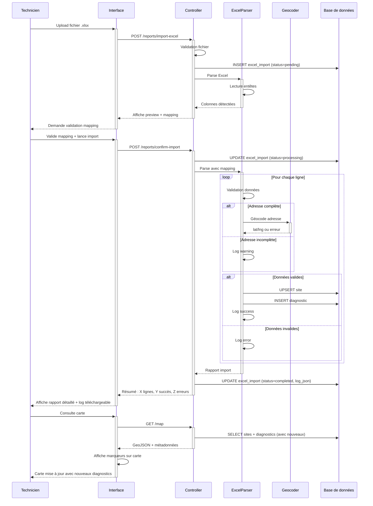
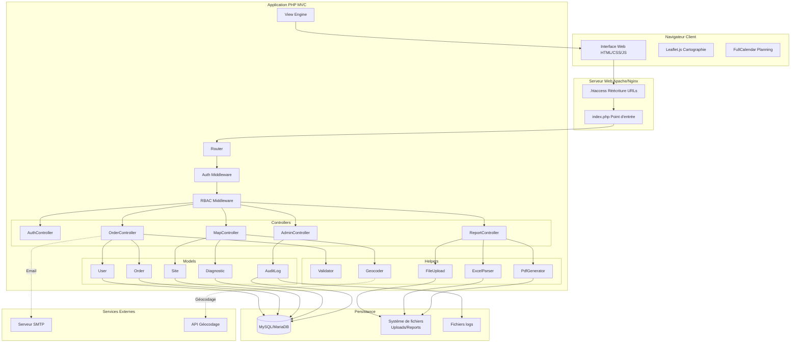
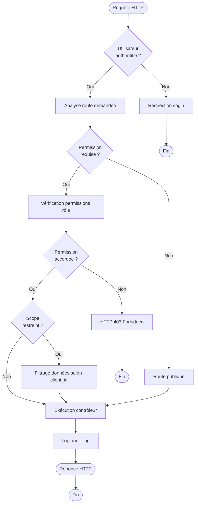
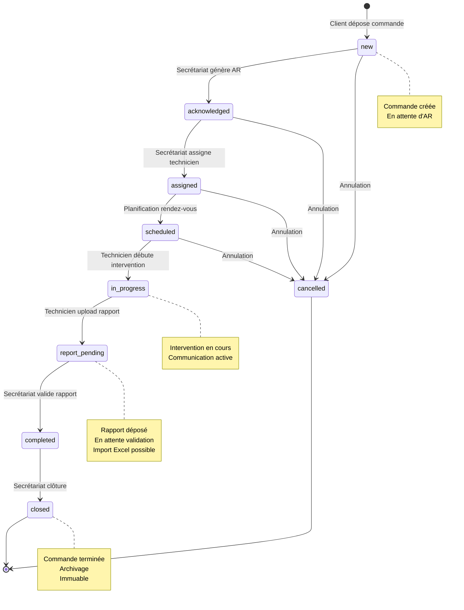
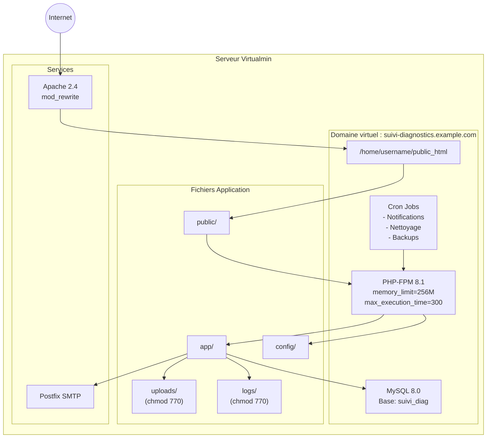
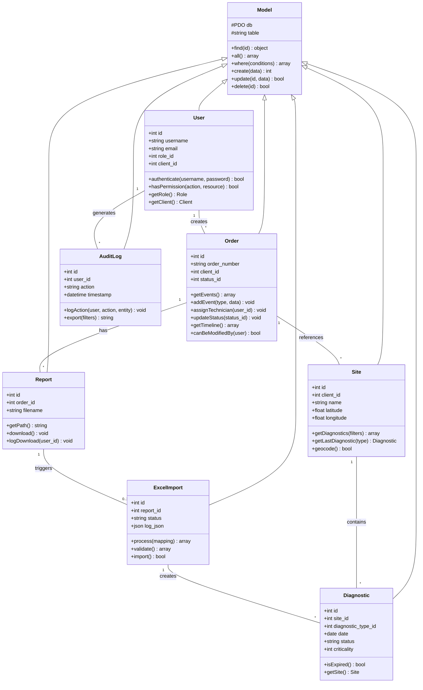

# Diagrammes - Plateforme de Suivi de Commandes

## 1. Diagramme Entité-Relation (ERD)

## 2. Diagramme de Cas d'Usage

```mermaid
graph TB
    subgraph "Acteurs"
        CLIENT[Client PCH]
        SECRET[Secrétariat]
        TECH[Technicien]
        ADMIN[Administrateur]
    end

    subgraph "Cas d'Usage - Gestion Commandes"
        UC1[Déposer une commande]
        UC2[Créer un bon de commande]
        UC3[Générer/Déposer AR]
        UC4[Assigner technicien]
        UC5[Planifier rendez-vous]
        UC6[Suivre avancement]
        UC7[Clôturer commande]
    end

    subgraph "Cas d'Usage - Interventions"
        UC8[Consulter planning]
        UC9[Voir interventions assignées]
        UC10[Mettre à jour statut]
        UC11[Déposer rapport PDF]
        UC12[Uploader Excel cartographie]
    end

    subgraph "Cas d'Usage - Cartographie"
        UC13[Consulter carte patrimoine]
        UC14[Filtrer diagnostics]
        UC15[Voir historique amiante]
        UC16[Consulter fiche site]
    end

    subgraph "Cas d'Usage - Communication"
        UC17[Échanger via messagerie]
        UC18[Télécharger rapports]
        UC19[Consulter timeline]
    end

    subgraph "Cas d'Usage - Administration"
        UC20[Gérer utilisateurs]
        UC21[Gérer référentiels]
        UC22[Consulter audit log]
        UC23[Exporter données]
        UC24[Configurer paramètres]
    end

    CLIENT --> UC1
    CLIENT --> UC6
    CLIENT --> UC13
    CLIENT --> UC14
    CLIENT --> UC15
    CLIENT --> UC16
    CLIENT --> UC17
    CLIENT --> UC18
    CLIENT --> UC19

    SECRET --> UC2
    SECRET --> UC3
    SECRET --> UC4
    SECRET --> UC5
    SECRET --> UC6
    SECRET --> UC7
    SECRET --> UC17
    SECRET --> UC19
    SECRET --> UC23

    TECH --> UC8
    TECH --> UC9
    TECH --> UC10
    TECH --> UC11
    TECH --> UC12
    TECH --> UC17
    TECH --> UC19

    ADMIN --> UC20
    ADMIN --> UC21
    ADMIN --> UC22
    ADMIN --> UC23
    ADMIN --> UC24
```

## 3. Diagramme de Séquence - Workflow Complet Commande

## 4. Diagramme de Séquence - Import Excel Cartographie

## 5. Diagramme d'Architecture

## 6. Diagramme de Flux - Gestion des Permissions

## 7. Diagramme États-Transitions - Commande

## 8. Diagramme de Déploiement Virtualmin

## 9. Diagramme de Classes - Modèle Simplifié

---

Ces diagrammes peuvent être visualisés avec :
- Mermaid Live Editor : https://mermaid.live
- Extensions VSCode : Markdown Preview Mermaid Support
- Intégration GitLab/GitHub (rendu natif)
